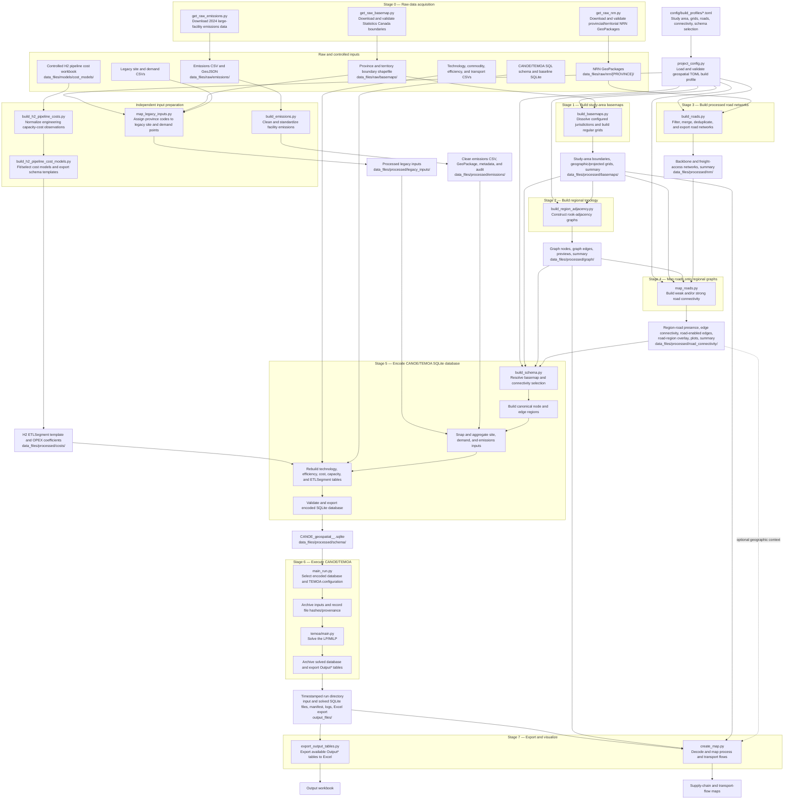

# Geospatial-CANOE

Geospatial-CANOE extends the CANOE/TEMOA energy-system modelling framework with a modular geospatial preprocessing pipeline. It converts Canadian boundary, road, emissions, demand, technology, and cost data into a spatial graph and then encodes that graph as a CANOE/TEMOA-compatible SQLite database.

The repository is an active research codebase. The current implementation uses the TEMOA v3-compatible CANOE backend and introduces mixed-integer formulations where transport infrastructure requires economies of scale, particularly for pipelines. Migration to TEMOA v4 is planned after the geospatial workflow is stable.

## Current capabilities

The workflow currently supports:

- configurable Canadian study areas defined by province and territory;
- geographic grids in EPSG:4326 and projected grids in EPSG:3347;
- centroid-based cell retention and rook adjacency;
- filtered National Road Network backbone and freight-access layers;
- weak and strong road-connectivity mapping;
- province assignment and graph-node snapping for legacy point inputs;
- preprocessing of 2024 large-facility greenhouse-gas emissions;
- topology-independent hydrogen-pipeline cost preprocessing and curve fitting;
- graph-based pipeline, truck, and electricity-transmission links;
- schema encoding into a CANOE/TEMOA SQLite database;
- timestamped model runs with archived inputs, solved databases, provenance records, and Excel exports;
- post-solve transport-flow mapping.

## Design philosophy

The pipeline is intentionally staged. Each expensive spatial or tabular transformation writes a durable intermediate product under `data_files/processed/`. These products act as checkpoints, so downstream stages can be rerun without repeating raw-data acquisition or earlier GIS operations.

The architecture separates three concerns:

1. **Build configuration** — a TOML profile controls the study area and geospatial preprocessing choices.
2. **Model data construction** — scripts transform raw and static inputs into a selected graph and encoded SQLite database.
3. **Model execution and analysis** — TEMOA solves the encoded database, after which outputs are exported and mapped.

The geospatial TOML profile is separate from the TEMOA solver configuration used by `main_run.py`.

## Repository structure

The tree below is intentionally curated. It shows the stable project architecture and omits virtual environments, type-checker caches, generated solver logs, and most individual data products.

```text
Geospatial-CANOE/
├── README.md
├── db_mgmt.py
├── db_update.py
├── requirements.txt
├── requirements-dev.txt
│
├── config/
│   └── build_profiles/
│       └── *.toml                 Geospatial preprocessing profiles
│
├── data_files/
│   ├── raw/                       Downloaded source datasets
│   │   ├── basemaps/
│   │   ├── emissions/
│   │   └── nrn/
│   ├── models/                    Controlled engineering and cost workbooks
│   │   └── cost_models/
│   ├── processed/                 Durable workflow checkpoints
│   │   ├── basemaps/
│   │   ├── costs/
│   │   ├── emissions/
│   │   ├── graph/
│   │   ├── legacy_inputs/
│   │   ├── nrn/
│   │   ├── road_connectivity/
│   │   └── schema/
│   ├── CANOE_geospatial.sqlite    Baseline CANOE/TEMOA database
│   ├── canoe_dataset_schema.sql   Base relational schema
│   └── *.csv                      Static model input tables
│
├── scripts/
│   ├── project_config.py
│   ├── get_raw_basemap.py
│   ├── get_raw_nrn.py
│   ├── get_raw_emissions.py
│   ├── build_basemaps.py
│   ├── build_region_adjacency.py
│   ├── build_roads.py
│   ├── map_roads.py
│   ├── map_legacy_inputs.py
│   ├── build_emissions.py
│   ├── build_h2_pipeline_costs.py
│   ├── build_h2_pipeline_cost_models.py
│   ├── build_schema.py
│   ├── main_run.py
│   ├── export_output_tables.py
│   ├── create_map.py
│   └── model_workflow.md
│
├── diagnostics/                  Input, balance, and run-audit utilities
├── notebooks/                    Exploratory and development notebooks
├── figures/                      Generated maps and diagnostic figures
├── output_files/                 Timestamped optimization runs
├── legacy_files/                 Retained legacy data and references
├── legacy_workflow/              Superseded workflow implementations
└── temoa/                        CANOE/TEMOA optimization backend
```

Most active development occurs in `scripts/`. Generated intermediate products belong under `data_files/processed/`, while solved scenarios and run provenance belong under `output_files/`.

## Configuration

Stages 1–5 use a shared TOML build profile loaded by `project_config.py`. A typical profile defines:

- study-area label and included provinces or territories;
- geographic and projected grid resolutions;
- centroid retention and coordinate precision;
- rook-adjacency settings;
- road classes, processed road networks, and output CRS;
- weak and/or strong road-connectivity methods;
- the road-connectivity method and basemap used during schema construction;
- point-assignment boundary and snapping tolerances.

Example profile path:

```text
config/build_profiles/provinces_only.toml
```

The same profile should be used consistently across basemap, adjacency, road, connectivity, legacy-input, and schema stages.

## Workflow

### Stage 0 — Acquire raw datasets

```bash
python scripts/get_raw_basemap.py
python scripts/get_raw_nrn.py
python scripts/get_raw_emissions.py
```

Use `--overwrite` to replace valid existing raw outputs. The basemap and NRN scripts also accept optional output-directory overrides.

Primary outputs:

```text
data_files/raw/basemaps/
data_files/raw/nrn/{PROVINCE}/
data_files/raw/emissions/co2_large_facilities_2024/
```

### Stage 0B — Prepare static point and cost inputs

Assign province codes to the legacy site and demand tables:

```bash
python scripts/map_legacy_inputs.py \
    --config config/build_profiles/provinces_only.toml
```

Prepare the hydrogen-pipeline engineering cost dataset:

```bash
python scripts/build_h2_pipeline_costs.py
python scripts/build_h2_pipeline_cost_models.py
```

The first script standardizes the controlled workbook into a canonical capacity-cost table. The second fits and selects cost functions, then exports topology-independent `ETLSegment` and OPEX templates used by `build_schema.py`.

### Stage 1 — Build study-area basemaps

```bash
python scripts/build_basemaps.py \
    --config config/build_profiles/provinces_only.toml
```

Outputs include dissolved study-area boundaries, all configured geographic and projected grids, and a profile-level basemap summary.

### Stage 2 — Build regional adjacency

```bash
python scripts/build_region_adjacency.py \
    --config config/build_profiles/provinces_only.toml
```

For each matching Stage 1 basemap, this stage exports graph-node polygons, graph-edge tables and geometries, preview figures, and a profile-level graph summary.

### Stage 3 — Build processed road networks

```bash
python scripts/build_roads.py \
    --config config/build_profiles/provinces_only.toml
```

The script filters the selected provincial and territorial NRN layers into nested road representations:

- **backbone** — freeway, expressway/highway, and ramp;
- **freight access** — backbone classes plus arterial roads.

Study-area GeoPackages and summary tables are always exported. Provincial outputs are optional and controlled by the build profile.

### Stage 4 — Map roads onto the regional graph

```bash
python scripts/map_roads.py \
    --config config/build_profiles/provinces_only.toml
```

Two road-connectivity definitions are available:

- **weak** — both endpoint regions contain at least one road segment;
- **strong** — both endpoint regions intersect at least one common road segment.

The stage exports region-road presence tables, edge-connectivity tables, road-enabled edge geometries, road-region overlays, optional diagnostic figures, and a profile-level summary.

### Stage 5 — Encode the CANOE/TEMOA schema

```bash
python scripts/build_schema.py \
    --config config/build_profiles/provinces_only.toml
```

This stage selects or resolves one compatible basemap and road-connectivity method, loads the Stage 1–4 products, snaps tabular and point inputs to graph nodes, rebuilds the relevant CANOE/TEMOA tables, applies topology-independent pipeline cost templates to graph corridors, validates the encoded tables, and writes:

```text
data_files/processed/schema/
    CANOE_geospatial_<basemap_stem>_<connection_method>.sqlite
```

The current generalized pipeline assumption applies the processed hydrogen-pipeline capacity and cost representation to all pipeline technologies until commodity-specific pipeline cost layers are available.

### Stage 6 — Execute CANOE/TEMOA

```bash
python scripts/main_run.py
```

The interactive run workflow selects an encoded SQLite database and a TEMOA configuration, updates the database path used by the configuration, creates a timestamped run directory, records file hashes and provenance, archives the input database, executes TEMOA, archives the solved database, and exports available `Output*` tables to Excel.

Typical run outputs:

```text
output_files/<timestamped_run>/
    input_*.sqlite
    solved_*.sqlite
    manifest.json
    run configuration and logs
    output_tables.xlsx
```

### Stage 7 — Export and visualize results

Export output tables independently when needed:

```bash
python scripts/export_output_tables.py
```

Generate supply-chain and transport-flow maps:

```bash
python scripts/create_map.py
```

`create_map.py` infers the matching basemap and graph products from the selected run or database name and can optionally display web tiles, road overlays, road-enabled edges, and parallel transport arcs.

## Canonical execution order

```text
get_raw_basemap.py
get_raw_nrn.py
get_raw_emissions.py
        │
        ├── map_legacy_inputs.py
        ├── build_emissions.py
        └── build_h2_pipeline_costs.py
                └── build_h2_pipeline_cost_models.py

build_basemaps.py
        └── build_region_adjacency.py

build_roads.py
        └── map_roads.py

all prepared inputs
        └── build_schema.py
                └── main_run.py
                        ├── export_output_tables.py
                        └── create_map.py
```

`build_emissions.py`, `map_legacy_inputs.py`, and the hydrogen-pipeline cost scripts do not depend on the regional adjacency graph and can be rerun independently when their source data change.

## Workflow diagram

The diagram below shows the dependency structure rather than only the nominal script order. Independent input-preparation branches converge during schema construction, after which model execution and post-processing operate on the encoded database and solved run products.



## Intermediate products

Important processed directories include:

```text
data_files/processed/basemaps/
data_files/processed/graph/
data_files/processed/nrn/
data_files/processed/road_connectivity/
data_files/processed/legacy_inputs/
data_files/processed/emissions/
data_files/processed/costs/
data_files/processed/schema/
```

These products are intended to be inspectable and reproducible. Rebuilding a stage may overwrite its own output files, but stages should not append duplicate records to existing GeoPackages or SQLite databases without first replacing or rebuilding the target product.

## Model formulation notes

Geospatial-CANOE represents model regions as graph nodes and candidate transport corridors as graph edges. Pipeline and electricity-transmission technologies may use the full candidate graph, while truck technologies are restricted to road-enabled edges under the selected connectivity method.

The current transport infrastructure formulation uses piecewise capacity-cost segments and therefore introduces integer or binary decisions. Development runs commonly use a non-zero MIP gap to reduce solve time. Scientific runs should document the selected solver, optimality gap, time limit, and termination status.

## Current limitations

- centroid retention and rook adjacency are the only implemented basemap and neighbourhood methods;
- rail, marine, and existing natural-gas infrastructure are not yet encoded as dedicated transport layers;
- pipeline routing follows candidate graph corridors rather than a terrain-aware routing model;
- the current generalized pipeline cost layer is based on hydrogen-pipeline data;
- the schema workflow remains tied to the current CANOE/TEMOA database structure;
- multi-period scenario logic and uncertainty analysis are still under development.

## Planned development

Priority extensions include:

- commodity-specific CO₂, hydrogen, fuel, and natural-gas pipeline cost models;
- geological CO₂ storage, DAC, BECCS, and additional carbon-management pathways;
- rail, marine, reused natural-gas corridors, and expanded electricity transmission;
- e-diesel, e-SAF, and e-methanol pathways;
- multi-period optimization and improved temporal representation;
- terrain- and infrastructure-aware routing;
- multi-objective and modelling-to-generate-alternatives analysis;
- network robustness, hub persistence, and near-optimal corridor analysis;
- stronger automated input, balance, and schema-integrity tests.

## Status

The preprocessing and schema-building pipeline is operational for the current road, truck, pipeline, and electricity-transmission representation. The codebase remains under active refactoring and should be treated as research software rather than a stable public API.

For the full dependency diagram, see [`scripts/model_workflow.md`](scripts/model_workflow.md).