# Geospatial-CANOE model workflow

This file is the standalone, detailed workflow reference used by developers. It
intentionally remains under `scripts/` as project documentation; it is not part
of the importable `src/geocanoe/` package.

The active implementation now lives under `src/geocanoe/`, while the files under
`scripts/` are thin command-line entry points. The diagram below therefore shows
the package-native implementation modules together with the CLI wrappers used to
launch them.

```mermaid
flowchart TD

    %% =====================================================================
    %% Configuration
    %% =====================================================================

    TOML["config/build_profiles/*.toml<br/>Study area, grids, hydrography, roads, connectivity, schema selection"]
    REG["registry/geospatial_sources.yaml v2<br/>Bronze roots and named artifacts; optional layers and domains"]
    PREG["registry/pipeline_impedance_*.yaml<br/>Impedance sources and penalty assumptions"]
    CFG["geocanoe.config<br/>Load and validate geospatial build profile"]
    TOML --> CFG

    %% =====================================================================
    %% Raw acquisition
    %% =====================================================================

    BRONZE["geocanoe.execution.bronze<br/>Select, dispatch, time, and report Bronze stages"]

    subgraph ACQ["Source acquisition — geocanoe.acquisition"]
        A1["basemaps.py<br/>Statistics Canada boundaries"]
        A2["residential.py<br/>Census DA boundaries and population table"]
        A3["gasoline_demand.py<br/>Fuel sales and population-centre boundaries"]
        A4["aboriginal_lands.py<br/>Aboriginal Lands legislative boundaries"]
        A5["nrn.py<br/>National Road Network GeoPackages"]
        A6["nhn.py<br/>National Hydro Network hydrography"]
        A7["emissions.py<br/>2024 large-facility emissions data"]
        A8["co2_storage.py<br/>Acquire selected local CanCO₂ release"]
    end

    BRONZE --> A1
    BRONZE --> A2
    BRONZE --> A3
    BRONZE --> A4
    BRONZE --> A5
    BRONZE --> A6
    BRONZE --> A7
    BRONZE --> A8

    subgraph RAW["Raw and controlled inputs"]
        R1["Boundary shapefile<br/>data_files/raw/basemaps/"]
        R2["DA boundaries and population table<br/>data_files/raw/residential/"]
        RG["Fuel-sales table and population-centre boundaries<br/>data_files/raw/gasoline_demand/"]
        R3["Aboriginal Lands shapefile, WMS metadata, and manifest<br/>data_files/raw/aboriginal_lands/"]
        R4["NRN GeoPackages<br/>data_files/raw/nrn/{PROVINCE}/"]
        R5["NHN hydrographic features, WMS metadata, and manifest<br/>data_files/raw/nhn/"]
        R6["Emissions CSV and GeoJSON<br/>data_files/raw/emissions/"]
        R7["Legacy site CSV for LCOE and electricity attributes"]
        R8["Technology, commodity, efficiency, and transport CSVs"]
        R9["CANOE/TEMOA SQL schema and baseline SQLite"]
        R10["Controlled H2 pipeline cost workbook<br/>data_files/models/cost_models/"]
        R11["CanCO₂ release family and selection marker<br/>data_files/raw/canco2_storage/"]
    end

    A1 --> R1
    A2 --> R2
    A3 --> RG
    A4 --> R3
    A5 --> R4
    A6 --> R5
    A7 --> R6
    A8 --> R11

    %% =====================================================================
    %% Silver preprocessing
    %% =====================================================================

    subgraph SILVER["Silver preprocessing — geocanoe.execution.silver"]
        L1["geocanoe.preprocessing.legacy_inputs<br/>Assign province codes"]
        D1["geocanoe.preprocessing.gasoline_demand<br/>Select population-centre proxies and map DAs"]
        D2["geocanoe.preprocessing.gasoline_demand<br/>Allocate provincial gasoline sales"]
        D3["geocanoe.preprocessing.gasoline_demand<br/>Map proxy demand onto every basemap"]
        E1["geocanoe.emissions.facilities<br/>Clean facility emissions"]
        C1["geocanoe.costs.pipelines.h2.capacity_costs<br/>Normalize H2 pipeline capacity-cost data"]
        C2["geocanoe.costs.pipelines.h2.cost_models<br/>Fit/select H2 pipeline cost models"]
        B1["geocanoe.geospatial.basemaps<br/>Build regular study-area grids"]
        A0["geocanoe.geospatial.aboriginal_lands<br/>Build Aboriginal Lands impedance evidence"]
        P0["geocanoe.geospatial.population_impedance<br/>Build population-density impedance evidence"]
        H1["geocanoe.geospatial.hydrography<br/>Select and clip registered NHN features"]
        H2["geocanoe.geospatial.nhn_impedance<br/>Build hydrography impedance evidence"]
        S0["geocanoe.geospatial.co2_storage<br/>Map storage evidence onto onshore regions"]
        G1["geocanoe.geospatial.adjacency<br/>Build rook-adjacency graph"]
        I1["geocanoe.geospatial.pipeline_edge_impedance<br/>Aggregate evidence onto graph edges"]
        N1["geocanoe.geospatial.roads<br/>Build processed road networks"]
        M1["geocanoe.geospatial.road_connectivity<br/>Map roads onto graph edges"]
    end

    CFG --> L1
    CFG --> D1
    CFG --> D2
    CFG --> D3
    CFG --> B1
    CFG --> A0
    CFG --> P0
    CFG --> H1
    REG --> H1
    REG --> A0
    REG --> P0
    PREG --> A0
    PREG --> P0
    PREG --> H2
    CFG --> S0
    CFG --> G1
    CFG --> I1
    CFG --> N1
    CFG --> M1

    R1 --> L1
    R7 --> L1
    RG --> D1
    R2 --> D1
    D1 --> D2
    RG --> D2
    D2 --> D3
    R6 --> E1
    R10 --> C1
    C1 --> C2

    R1 --> B1
    B1 --> BP["Processed basemaps<br/>data_files/processed/basemaps/"]
    BP --> D3
    BP --> A0
    BP --> P0
    BP --> H1
    R2 --> P0
    R3 --> A0
    A0 --> IP["Pipeline-impedance polygon evidence and edge multipliers<br/>data_files/processed/pipeline_impedance/{build-id}/"]
    P0 --> IP
    R5 --> H1
    H1 --> HP["Filtered hydrography, summary, manifest, and PNG previews<br/>data_files/processed/nhn/"]
    H1 --> H2
    H2 --> IP
    BP --> S0
    R11 --> S0
    S0 --> SP["Storage evidence, crosswalks, and previews<br/>data_files/processed/co2_storage/"]
    BP --> G1
    G1 --> GP["Graph nodes and edges<br/>data_files/processed/graph/"]
    GP --> I1
    A0 --> I1
    P0 --> I1
    H2 --> I1
    I1 --> IP

    R4 --> N1
    N1 --> NP["Processed road networks<br/>data_files/processed/nrn/"]

    BP --> M1
    GP --> M1
    NP --> M1
    M1 --> MP["Road connectivity products<br/>data_files/processed/road_connectivity/"]

    L1 --> LP["Processed legacy inputs<br/>data_files/processed/legacy_inputs/"]
    D2 --> DP["Proxy geometry, DA crosswalk, and allocated demand<br/>data_files/processed/gasoline_demand/{build-id}/"]
    D3 --> DP
    E1 --> EP["Processed emissions<br/>data_files/processed/emissions/"]
    C2 --> CP["Pipeline cost templates<br/>data_files/processed/costs/"]

    %% =====================================================================
    %% Schema encoding
    %% =====================================================================

    subgraph SCHEMA["Schema encoding — geocanoe.schema.build"]
        S1["Resolve basemap, storage evidence, regional gasoline demand, graph, road layer, and connectivity"]
        S2["Build canonical node and edge regions"]
        S3["Snap and aggregate point inputs"]
        S4["Rebuild technology, efficiency, cost, capacity, and ETLSegment tables"]
        S5["Validate and export encoded SQLite database"]
    end

    CFG --> S1
    BP --> S1
    SP --> S1
    GP --> S1
    IP --> S1
    MP --> S1
    DP --> S1
    LP --> S3
    EP --> S3
    CP --> S4
    R8 --> S4
    R9 --> S4

    S1 --> S2 --> S3 --> S4 --> S5
    S5 --> DB["CANOE_geospatial_<basemap>_<road_layer>_<method>.sqlite<br/>data_files/processed/schema/"]

    %% =====================================================================
    %% Model execution
    %% =====================================================================

    subgraph EXEC["Model execution — geocanoe.execution"]
        RUN1["run.py<br/>Single-scenario execution"]
        BATCH["batch.py<br/>Ordered batch execution"]
        RUN2["Archive inputs and provenance"]
        RUN3["temoa/main.py<br/>Solve LP/MILP"]
        RUN4["Archive solved database"]
    end

    DB --> RUN1
    DB --> BATCH
    BATCH --> RUN1
    RUN1 --> RUN2 --> RUN3 --> RUN4

    RUN4 --> OUT["Timestamped run directory<br/>input/solved SQLite, manifest, logs<br/>output_files/"]

    %% =====================================================================
    %% Analysis
    %% =====================================================================

    subgraph ANALYSIS["Post-solve analysis — geocanoe.analysis"]
        X1["exports.py<br/>Export Output* tables to Excel"]
        X2["maps.py<br/>Interactive Folium model-output map"]
    end

    OUT --> X1
    OUT --> X2
    GP --> X2
    BP --> X2
    MP -. optional geographic context .-> X2

    X1 --> F1["Excel workbook"]
    X2 --> F2["Interactive Folium HTML map"]
```



## CLI entry points

Editable or regular installation through `pyproject.toml` provides eight
canonical commands:

```text
geocanoe-build-bronze   → geocanoe.execution.bronze:main
geocanoe-build-silver   → geocanoe.execution.silver:main
geocanoe-build-schema   → geocanoe.schema.build:main
geocanoe-run            → geocanoe.execution.run:main
geocanoe-batch          → geocanoe.execution.batch:main
geocanoe-diagnostics    → geocanoe.diagnostics.cli:main
geocanoe-export         → geocanoe.analysis.exports:main
geocanoe-map            → geocanoe.analysis.maps:main
```

The following files remain as thin compatibility wrappers:

```text
scripts/
├── batch_run.py
├── build_bronze.py
├── build_schema.py
├── build_silver.py
├── create_map_folium.py
├── export_output_tables.py
├── main_run.py
└── model_workflow.md
```

The wrappers delegate to the package-native implementations:

```text
scripts/build_bronze.py
    → geocanoe.execution.bronze

scripts/build_silver.py
    → geocanoe.execution.silver

scripts/build_schema.py
    → geocanoe.schema.build

scripts/main_run.py
    → geocanoe.execution.run

scripts/batch_run.py
    → geocanoe.execution.batch

scripts/export_output_tables.py
    → geocanoe.analysis.exports

scripts/create_map_folium.py
    → geocanoe.analysis.maps
```

## Execution dependencies

- `geocanoe.execution.bronze` orchestrates eight independent acquisition stages and supports stage subsets, overwrite behavior, output-directory overrides, and archive-retention options.
- `registry/geospatial_sources.yaml` schema v2 inventories every Bronze stage using named fixed or globbed artifacts; source layers and coded domains are optional.
- `geocanoe.execution.silver` orchestrates seventeen Silver preprocessing stages and validates their upstream dependencies.
- `geocanoe.geospatial.aboriginal_lands`, `population_impedance`, and
  `nhn_impedance` produce normalized polygon evidence for pipeline routing.
- `geocanoe.geospatial.pipeline_edge_impedance` requires adjacency plus all
  three polygon-evidence stages and writes one multiplier for every directed
  graph edge.
- `geocanoe.geospatial.co2_storage` requires an acquired CanCO₂ release and processed basemaps; it currently maps only onto the onshore model-region domain.
- `geocanoe.geospatial.adjacency` requires processed basemaps.
- `geocanoe.geospatial.hydrography` requires processed basemaps plus the
  registered Bronze NHN GeoPackage, metadata snapshot, and acquisition manifest.
- `geocanoe.geospatial.road_connectivity` requires processed basemaps, graph products, and processed road networks.
- `geocanoe.schema.build` requires the selected basemap, processed CO₂-storage evidence, graph, road-connectivity products, processed legacy inputs, processed emissions, static CANOE tables, and pipeline cost templates.
- `geocanoe.execution.run` operates only on an already encoded SQLite database; it does not rebuild the schema.
- `geocanoe.execution.batch` launches each configured scenario as an independent subprocess through `python -m geocanoe.execution.run`.
- `geocanoe.analysis.exports` reads solved `Output*` tables and writes Excel workbooks.
- `geocanoe.analysis.maps` requires a solved model database plus the corresponding graph and basemap products; road-connectivity geometry is optional map context.

## Canonical execution paths

### Bronze acquisition

```bash
geocanoe-build-bronze
```

Run a subset with `--stages`, for example:

```bash
geocanoe-build-bronze --stages aboriginal_lands nhn
```

### CanCO₂ storage acquisition

```bash
python -m geocanoe.acquisition.co2_storage
```

### Silver preprocessing

```bash
geocanoe-build-silver --config config/build_profiles/sample_build_profile.toml
```

Package-module equivalent:

```bash
python -m geocanoe.execution.silver --config config/build_profiles/sample_build_profile.toml
```

### Schema encoding

```bash
geocanoe-build-schema --config config/build_profiles/sample_build_profile.toml
```

Package-native equivalent:

```bash
python -m geocanoe.schema.build --config config/build_profiles/sample_build_profile.toml
```

### Single model run

```bash
geocanoe-run
```

Package-native equivalent:

```bash
python -m geocanoe.execution.run
```

### Batch execution

```bash
geocanoe-batch --config config/batch_profiles/batch_run.toml
```

Package-native equivalent:

```bash
python -m geocanoe.execution.batch --config config/batch_profiles/batch_run.toml
```

### Output export

```bash
geocanoe-export
```

Package-native equivalent:

```bash
python -m geocanoe.analysis.exports
```

### Interactive map

```bash
geocanoe-map
```

Package-native equivalent:

```bash
python -m geocanoe.analysis.maps
```

## Path conventions

Repository-level data and model outputs are resolved through
`geocanoe.paths.find_project_root()`.

Package modules should not construct repository paths using hardcoded
`Path(__file__).resolve().parents[...]` assumptions. Repository data remain under:

```text
data_files/
output_files/
config/
```

and must not be created under `src/geocanoe/`.

## Intermediate products

Important durable products include:

```text
data_files/processed/basemaps/
data_files/processed/co2_storage/
data_files/processed/graph/
data_files/processed/nhn/
data_files/processed/pipeline_impedance/
data_files/processed/nrn/
data_files/processed/road_connectivity/
data_files/processed/gasoline_demand/
data_files/processed/legacy_inputs/
data_files/processed/emissions/
data_files/processed/costs/
data_files/processed/schema/
```

These intermediate products are intended to be inspectable and reproducible.
Individual stages may overwrite products they own, but should not silently append
duplicate records to existing GeoPackages or SQLite databases.

## Current execution notes

- The silver pipeline is package-native and uses function executors for its current stages.
- Single-run execution is package-native under `geocanoe.execution.run`.
- Batch execution invokes the single-run module with `python -m geocanoe.execution.run`.
- Batch status is persisted incrementally to JSON and CSV.
- The batch configuration currently includes `skip_completed` and `retry_failed`; full persistent resume semantics remain future work.
- Post-solve maps are generated by the Folium renderer in `geocanoe.analysis.maps`.
