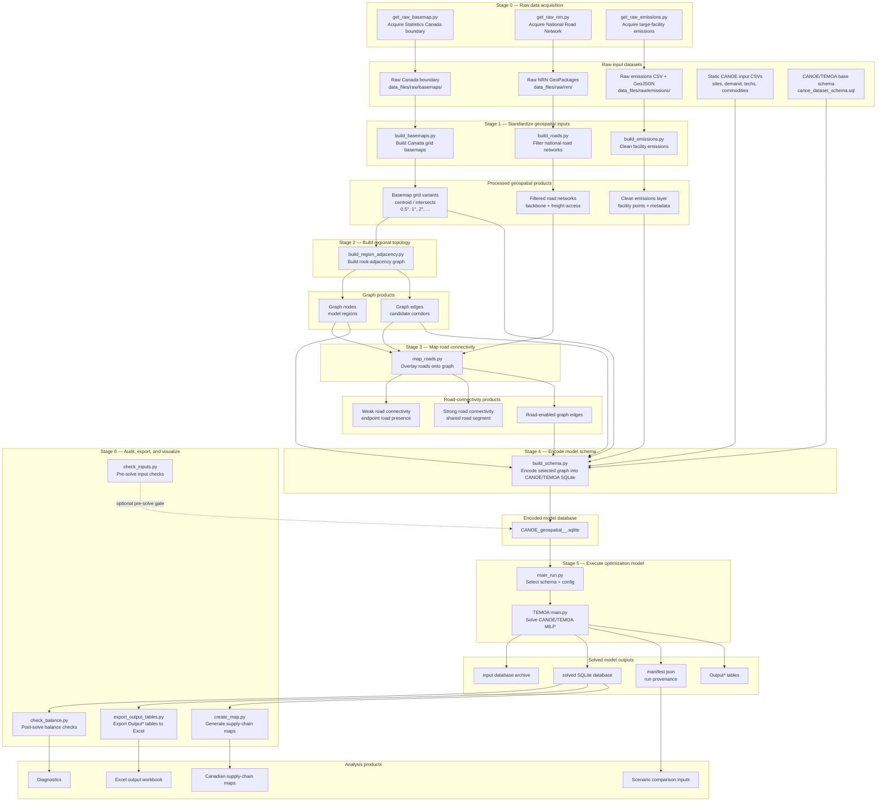

```mermaid
flowchart TD

    %% =====================================================================
    %% Geospatial-CANOE Formal Workflow Diagram
    %% =====================================================================

    subgraph STAGE0["Stage 0 — Raw data acquisition"]
        A1["get_raw_basemap.py<br/>Acquire Statistics Canada boundary"]
        A2["get_raw_nrn.py<br/>Acquire National Road Network"]
        A3["get_raw_emissions.py<br/>Acquire large-facility emissions"]
    end

    subgraph RAW["Raw input datasets"]
        R1["Raw Canada boundary<br/>data_files/raw/basemaps/"]
        R2["Raw NRN GeoPackages<br/>data_files/raw/nrn/"]
        R3["Raw emissions CSV + GeoJSON<br/>data_files/raw/emissions/"]
        R4["Static CANOE input CSVs<br/>sites, demand, techs, commodities"]
        R5["CANOE/TEMOA base schema<br/>canoe_dataset_schema.sql"]
    end

    subgraph STAGE1["Stage 1 — Standardize geospatial inputs"]
        B1["build_basemaps.py<br/>Build Canada grid basemaps"]
        B2["build_roads.py<br/>Filter national road networks"]
        B3["build_emissions.py<br/>Clean facility emissions"]
    end

    subgraph PROCESSED1["Processed geospatial products"]
        P1["Basemap grid variants<br/>centroid / intersects<br/>0.5°, 1°, 2°, ..."]
        P2["Filtered road networks<br/>backbone + freight-access"]
        P3["Clean emissions layer<br/>facility points + metadata"]
    end

    subgraph STAGE2["Stage 2 — Build regional topology"]
        C1["build_region_adjacency.py<br/>Build rook-adjacency graph"]
    end

    subgraph GRAPH["Graph products"]
        G1["Graph nodes<br/>model regions"]
        G2["Graph edges<br/>candidate corridors"]
    end

    subgraph STAGE3["Stage 3 — Map road connectivity"]
        D1["map_roads.py<br/>Overlay roads onto graph"]
    end

    subgraph ROADCONN["Road-connectivity products"]
        D2["Weak road connectivity<br/>endpoint road presence"]
        D3["Strong road connectivity<br/>shared road segment"]
        D4["Road-enabled graph edges"]
    end

    subgraph STAGE4["Stage 4 — Encode model schema"]
        E1["build_schema.py<br/>Encode selected graph into CANOE/TEMOA SQLite"]
    end

    subgraph MODELDB["Encoded model database"]
        E2["CANOE_geospatial_<basemap>_<method>.sqlite"]
    end

    subgraph STAGE5["Stage 5 — Execute optimization model"]
        F1["main_run.py<br/>Select schema + config"]
        F2["TEMOA main.py<br/>Solve CANOE/TEMOA MILP"]
    end

    subgraph OUTPUTS["Solved model outputs"]
        O1["input database archive"]
        O2["solved SQLite database"]
        O3["manifest.json<br/>run provenance"]
        O4["Output* tables"]
    end

    subgraph STAGE6["Stage 6 — Audit, export, and visualize"]
        H1["check_inputs.py<br/>Pre-solve input checks"]
        H2["check_balance.py<br/>Post-solve balance checks"]
        H3["export_output_tables.py<br/>Export Output* tables to Excel"]
        H4["create_map.py<br/>Generate supply-chain maps"]
    end

    subgraph FINAL["Analysis products"]
        Z1["Diagnostics"]
        Z2["Excel output workbook"]
        Z3["Canadian supply-chain maps"]
        Z4["Scenario comparison inputs"]
    end

    %% Raw acquisition outputs
    A1 --> R1
    A2 --> R2
    A3 --> R3

    %% Raw to standardized products
    R1 --> B1
    R2 --> B2
    R3 --> B3

    B1 --> P1
    B2 --> P2
    B3 --> P3

    %% Topology construction
    P1 --> C1
    C1 --> G1
    C1 --> G2

    %% Road connectivity
    P2 --> D1
    G1 --> D1
    G2 --> D1
    D1 --> D2
    D1 --> D3
    D1 --> D4

    %% Schema encoding
    G1 --> E1
    G2 --> E1
    D4 --> E1
    P1 --> E1
    P3 --> E1
    R4 --> E1
    R5 --> E1
    E1 --> E2

    %% Run workflow
    H1 -. optional pre-solve gate .-> E2
    E2 --> F1
    F1 --> F2
    F2 --> O1
    F2 --> O2
    F2 --> O3
    F2 --> O4

    %% Post-processing
    O2 --> H2
    O2 --> H3
    O2 --> H4
    H2 --> Z1
    H3 --> Z2
    H4 --> Z3
    O3 --> Z4

```