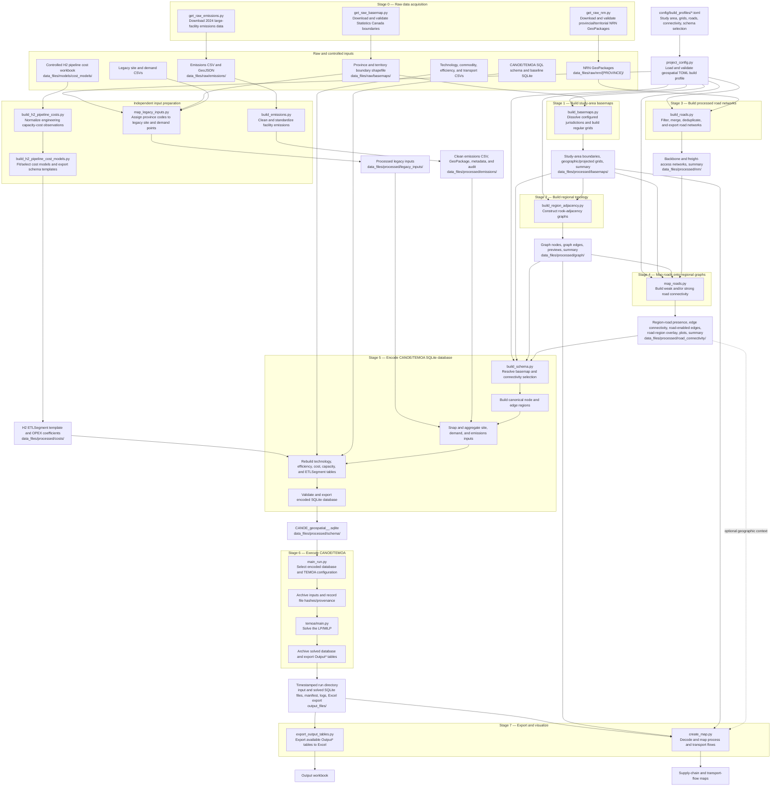

# Geospatial-CANOE model workflow

This file is the standalone, detailed workflow reference used by developers. The README contains the same diagram for repository-level orientation, while this file retains the dependency notes immediately below it.

## Execution dependencies

- `build_basemaps.py`, `build_region_adjacency.py`, `build_roads.py`, `map_roads.py`, `map_legacy_inputs.py`, and `build_schema.py` must use the same TOML build profile.
- `build_region_adjacency.py` requires the Stage 1 basemaps.
- `map_roads.py` requires both the Stage 2 graph products and Stage 3 processed road networks.
- `build_schema.py` requires the selected Stage 1–4 geospatial products, processed legacy inputs, processed emissions, static CANOE tables, and the H2 pipeline cost templates.
- `main_run.py` operates only on an already encoded SQLite database; it does not rebuild the schema.
- `create_map.py` requires a 